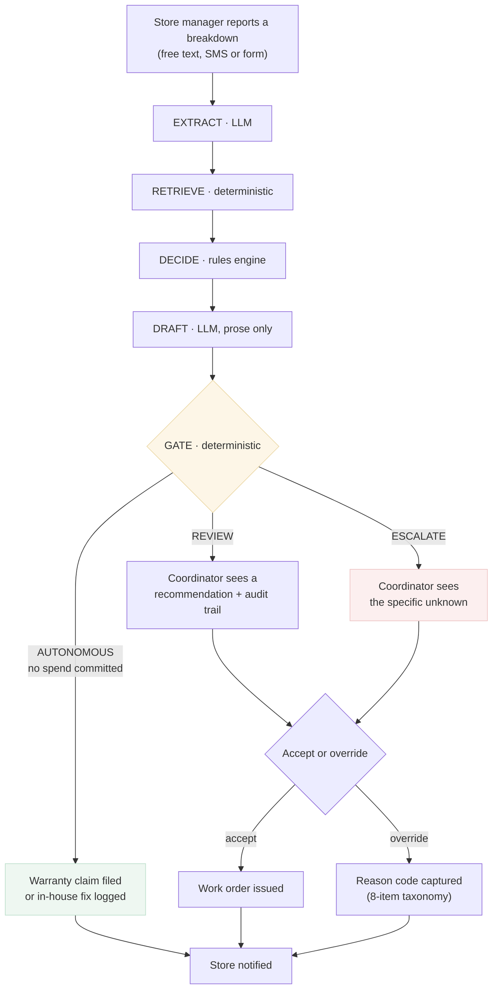

# Solution design

To-be journey, service blueprint, value model and operating model. Day-2 artifacts.

---

## 1. To-be journey

**The coordinator's job changes shape rather than disappearing.** Today she does 26 minutes
of lookup on every report. After: she sees nothing at all for the clean ones, and for the
rest she sees a specific question — *"is this FRY-02 or FRY-03?"*, *"this failed 8 days
before expiry, do we claim?"* — rather than a blank ticket.

That is the design goal. Not "fewer tickets", but **the ones she does see are already
narrowed to the judgment call.**

---

## 2. Service blueprint

| Lane | Intake | Identify | Decide | Draft | Act |
|---|---|---|---|---|---|
| **Front stage** (store sees) | Types a message | — | — | — | "Engineer booked, Thursday am" |
| **Front stage** (coordinator sees) | — | Only if ambiguous: ranked candidate list | Only if gated: verdict + the rule that fired | Editable draft | One-click accept / override + reason |
| **Back stage** (system) | Normalise, store | Registry scoring, `topMargin` | W-rules, R-table, cost, SLA | Grounded generation + check | Work order, audit record |
| **Manual ops** (humans behind) | — | Registry data hygiene | Policy maintenance as terms change | — | Vendor relationship, disputed claims |
| **Support systems** | Ticket form, SMS gateway | Asset register | Warranty policy doc, PM portal | — | CMMS, AP |

**The manual-ops lane is the honest part of this diagram.** Two rows in it are permanent
human work that the product creates rather than removes:

- **Registry hygiene.** Everything here depends on the asset register being right. The
  product makes registry errors *visible* (as `NOT_IN_REGISTRY` and ambiguity gates) but
  does not fix them.
- **Policy maintenance.** Warranty terms change by manufacturer and by negotiated contract.
  Someone must own `docs/warranty-policy.md`. A rules engine nobody maintains decays into
  exactly the wrong answers, confidently delivered.

A version of this diagram without the manual-ops lane would be a better sales asset and a
worse plan.

---

## 3. Value model

**Primary metric — warranty-leakage catch rate.** Of reports on an in-warranty asset, the
share where coverage is correctly identified *before* a vendor is engaged.

Chosen over "dollars saved" because dollars arrive 30–45 days late on an invoice, while
catch rate is readable the day the decision is made. Dollars remain the confirmatory metric.

**Guardrail 1 — false-claim rate.** Share of filed warranty claims rejected by the
manufacturer. Catching more warranty is worthless if half the claims bounce; a rejection
costs a resubmission *and* the downtime spent waiting. Ceiling: no worse than the current
manual rate.

**Guardrail 2 — escalation rate.** Share of reports requiring a human. This is the cost side
of the primary metric. Driving leakage to zero by escalating everything is not a product,
it is a queue. Ceiling: 35% review load, which is what τ\* is solved against.

**Why not time-to-dispatch as primary?** It improves almost automatically and would flatter
the product. It is real, and it is reported — as a secondary.

---

## 4. Operating model

| | Today | With FirstCall |
|---|---|---|
| **People** | 2 coordinators, 80 stores | 2 coordinators, ~65% of reports never reach them |
| **Data** | Asset spreadsheet, PM portal, vendor matrix — three systems, no joins | Same three systems; the product does the join and *surfaces where it fails* |
| **Systems** | CMMS is the system of record | Unchanged. FirstCall writes work orders into it |
| **Manual ops** | All of it | Registry hygiene, policy upkeep, disputed claims, overrides |

### What breaks at 120 stores

Honest failure modes, in the order they bite:

1. **Registry drift, at ~100 stores.** New equipment gets installed faster than the register
   is updated. `NOT_IN_REGISTRY` escalations rise, and the product degrades into a router
   that asks a lot of questions. *Mitigation: track registry-miss rate as a health metric
   from day one; it is a leading indicator of the product silently getting worse.*
2. **Vendor coverage gaps.** More stores means more store/type pairs with no covering
   vendor. Each becomes an escalation. *Mitigation: report uncovered pairs as a procurement
   output, not as a product failure.*
3. **Policy fragmentation.** At scale, warranty terms stop being asset-class constants and
   become per-contract. The rules engine needs a contract table, not a constant table.
   *This is the first thing that would need rebuilding, and it is a data-model change rather
   than an AI change.*
4. **Escalation queue ownership.** At 120 stores, 35% review load is ~140 reports/day. That
   is a queue with an SLA of its own, and nobody currently owns it.

**What does not break:** inference cost. At ~250 tokens per report, 120 stores is roughly
$0.10/month. Cost of goods is not a decision variable here; **escalation labour is** — which
is why the τ sweep, not the model choice, is the economic lever.
